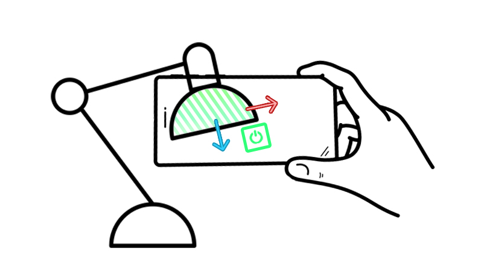
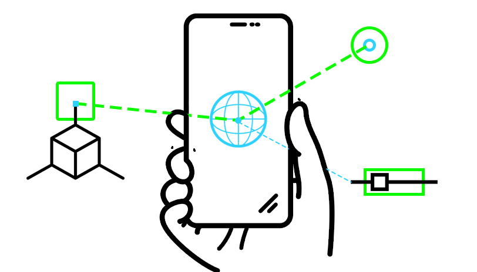
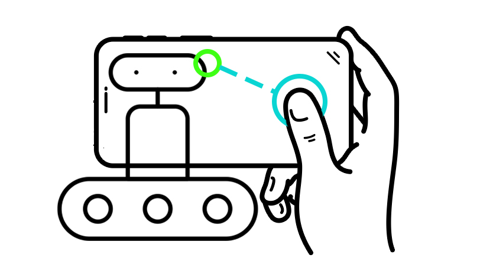

  

    <h3>A Toolbox for Spatial Computing Experiments</h3>
    
The Vuforia Spatial Toolbox and Vuforia Spatial Edge Server make up a shared research platform for exploring spatial computing as a community.

  

  

    <a class="button is-success is-pulled-right" href="/docs/use">
      Get Started
    </a>
  

  

    
    

        Spatial Tools
    

  

  

    
    

        Spatial Programming
    

  

  

    
    

        Spatial Robotic UI
    

  

  

    <h3>What is Vuforia Spatial Toolbox?</h3>
    

       

            <iframe src="https://www.youtube.com/embed/JLP2t7yymnQ?rel=0" frameborder="0" allow="autoplay;" allowfullscreen class="video" style="position: absolute;top: 0; left: 0; width: 100%; height: 100%;">
            
            </iframe>
        

    

  

  

  
  

  

  <h3>What do I use Vuforia Spatial Toolbox for</h3>
  

  

  

  

    
    

        1. Generate 2D and 3D AR content around you 
    

  

  

    
    

        2. Attach Spatial Tools and AR  Content to any physical object
    

  

  

    
    

        3. Program hardware system using AR interfaces
    

  

 

    <h3>Access our Tutorials</h3>
  

  

   <a class="button is-medium is-fullwidth is-info is-outlined" href="https://github.com/ptcrealitylab/vuforia-spatial-toolbox-documentation/tree/master/make%20tools">
   Make Tools</a>
  

  

   <a class="button is-medium is-fullwidth is-info is-outlined" href="https://github.com/ptcrealitylab/vuforia-spatial-toolbox-documentation/tree/master/use">
   Use the toolbox</a>
  

  

  

   <a class="button is-medium is-fullwidth is-info is-outlined" href="https://github.com/ptcrealitylab/vuforia-spatial-toolbox-documentation/tree/master/understandSystem">
   Understand the system</a>
  

  

    <a class="button is-medium is-fullwidth is-info is-outlined" href="https://github.com/ptcrealitylab/vuforia-spatial-toolbox-documentation/tree/master/interfaceWithHardware">
    Make hardware interfaces</a>
  

### Made with Vuforia Spatial Toolbox

|  | | |
| ------| -----------| -----------|
| [Feeder Machine](https://www.ptc.com/en/about/reality-lab/portfolio/research/editing-reality)| [AGV path planning](https://www.ptc.com/en/about/reality-lab/portfolio/research/kinetic-ar)| [Lock out Tag out](https://www.ptc.com/en/about/reality-lab/portfolio/experiment/editing-ar-in-space) |
