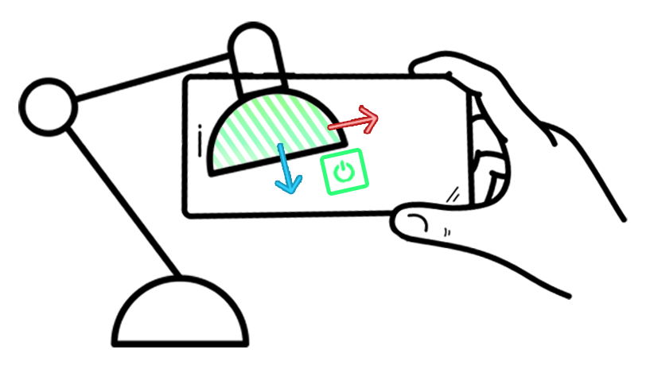
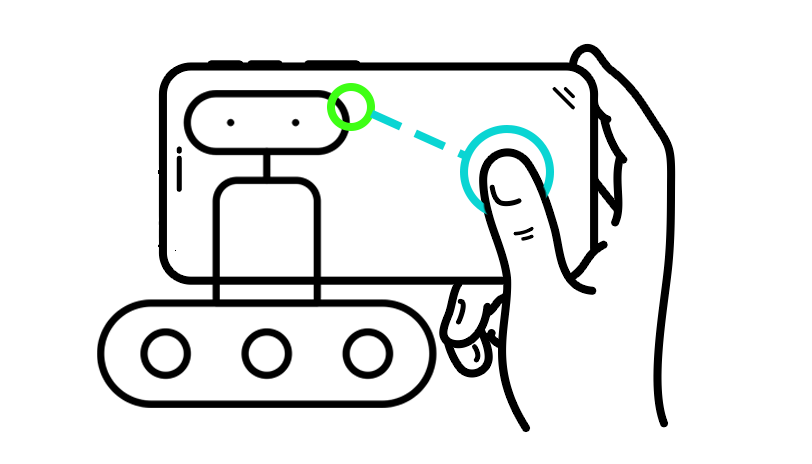
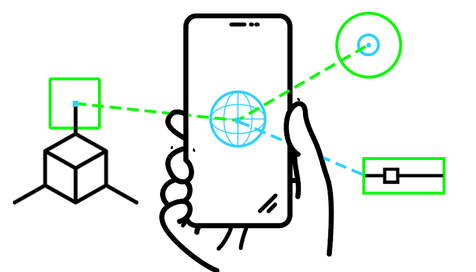

<section class="section">
    

        <h2 class="title">A Toolbox for Spatial Computing Experiments</h2>
        

            

                
The Vuforia Spatial Toolbox and Vuforia Spatial Edge Server make up a shared research platform for
                    exploring spatial computing.

            

            

                

                    <button class="button is-success   is-medium is-light is-pulled-right"
                            onclick="location.href='https://spatialtoolbox.vuforia.com/docs/download';">Download
                    </button>
                    <button class="button is-success   is-medium  is-light is-pulled-right"
                            onclick="location.href='https://spatialtoolbox.vuforia.com/docs/use';">Get Started
                    </button>
                

            

        

        

        

            &nbsp;
        

    

    

        

            

                

                
Spatial Tools

            

            

               

                
Spatial Programming

            

            

                

                
Spatial Robotic UI

            

        

    

    

        &nbsp;
    

    

        &nbsp;
    

    

        &nbsp;
    

    

        <h1 class="title header-home">What is Vuforia Spatial Toolbox?</h1>
        

            <iframe src="https://www.youtube.com/embed/k3uHFk1PAAM?rel=0" frameborder="0" allow="autoplay;"
                    allowfullscreen class="video"
                    style="position: absolute;top: 0; left: 0; width: 100%; height: 100%;">
                
            </iframe>
        

    

</section>
<section class="section">
    

        <h1 class="title header-home">What do I use Vuforia Spatial Toolbox for?</h1>
        

            

                <figure class="image is-5by3">
                    
                </figure>
                

                    1.  Attach Spatial Tools to objects tracked with <a href="https://developer.vuforia.com">Vuforia Engine</a>
                

            

            

                <figure class="image is-5by3">
                    
                </figure>
                

                    2.  Program physical machines spatially using <a href="https://www.kepware.com">Kepware</a> and other supported platforms
                

            

            

                <figure class="image is-5by3">
                    
                </figure>
                

                    3.  Generate your own 2D and 3D Spatial Tools to place in your environment
                

            

        

    

</section>
<section class="section is-small">
  

        

            

                
Adapting to the COVID-19 home office, we created a basic hardware interface addon. It allows you to connect the Vuforia Edge Server with your Arduino project, your children's Lego Boost and Lego Wedo 2.0 set, and as well the Philips Hue lighting system in your living room.

            

            

                

                    <button class="button is-success   is-medium is-light is-pulled-right"
                            onclick="location.href='https://github.com/ptcrealitylab/vuforia-spatial-basic-interfaces-addon';">
        <i class="fab fa-github"></i>
            
        Download
                    </button>
                

            

            </section>
<section class="section is-small">
    

        <h1 class="title header-home">Access our Tutorials</h1>
        

            

                

                    Use the Spatial Toolbox

            

            

                

                    Create new Tools

            

        

        

            

                

                    Create new hardware interfaces

            

            

                

                    Learn about the system

            

        

    

</section>
<section class="section">
    

        <h1 class="title header-home">Made with Vuforia Spatial Toolbox</h1>
        

            

                

                    <a href="https://www.ptc.com/en/about/reality-lab/portfolio/research/editing-reality">
                  

                        <figure class="image is-5by3">
                            
                        </figure>
                    

                    </a>
                    

                        <a href="https://www.ptc.com/en/about/reality-lab/portfolio/research/editing-reality">Feeder Machine</a>
                    

                

            

            

                

                    <a href="https://www.ptc.com/en/about/reality-lab/portfolio/research/kinetic-ar"> 

                        <figure class="image is-5by3">
                            
                        </figure>
                    
</a>
                    

                        

                            <a href="https://www.ptc.com/en/about/reality-lab/portfolio/research/kinetic-ar">AGV path planning</a>
                        

                    

                

            

            

            

        

    

</section>
